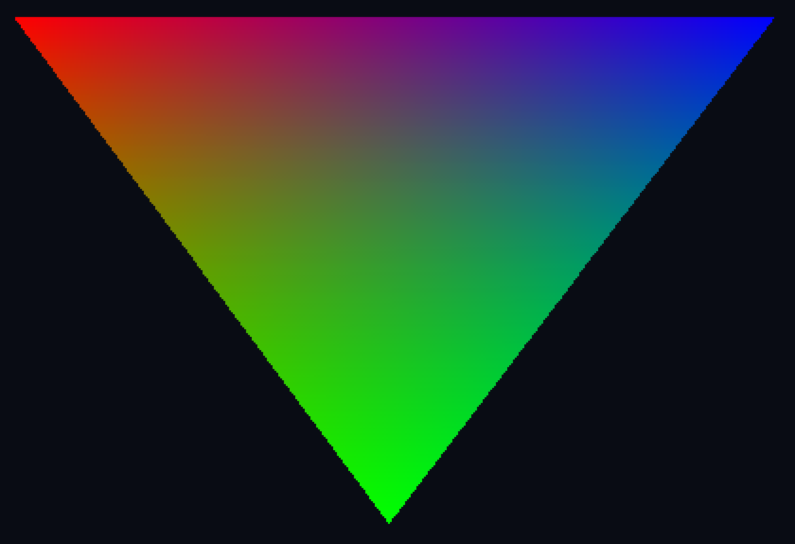
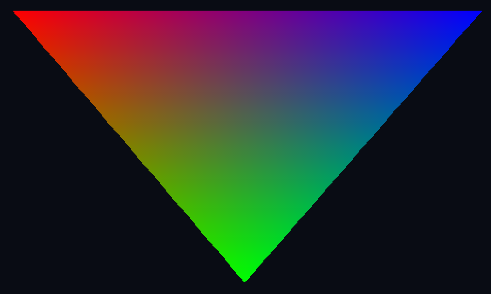

---
# This is a YAML preamble, defining pandoc meta-variables.
# Reference: https://pandoc.org/MANUAL.html#variables
# Change them as you see fit.
title: TDT4195 Exercise 2
author:
  - Øyvind Nestvold
  - Fredrik Robertsen
date: \today # This is a latex command, ignored for HTML output
lang: en-US
papersize: a4
geometry: margin=4cm
toc: false
toc-title: "Table of Contents"
toc-depth: 2
numbersections: true
header-includes:
# The `atkinson` font, requires 'texlive-fontsextra' on arch or the 'atkinson' CTAN package
# Uncomment this line to enable:
#- '`\usepackage[sfdefault]{atkinson}`{=latex}'
colorlinks: true
links-as-notes: true
# The document is following this break is written using "Markdown" syntax
---

## Task 1)

### a-b) Color VBO and shading coloring

This task was already implemented as part of exercise 1. But for ease of access we include the same render here.


OpenGL does a simple interpolation between the vertex colors, and assigns a color to a pixel during shading based on a weighted blend of the vertex colors based on how close the location of a pixel is to the vertices of the fragment. All weights should add up to 1, resulting in a varying mix of all the vertex colors at any given point in the fragment. In other words it does a simple linear interpolation.

## Task 2)

### a) Transparent triangles


Here we have drawn three partially overlapping triangles drawn in the order "red - green - blue" with red having the highest z-index (furthest back), followed by green and finally blue. All triangles are rendered with alpha = 0.4

### b)

#### I)
When reordering the color of the triangles the color of the overlapping segment shifts toward the new color. This effect is stronger the further to the front we change the color. The reason we observe this is because transparent triangles, will let some of the color of what is behind it through. When this happens we will "see" a mix of the background colors and the color of the triangle itself. Changing one color, thus changes the hue of the overlapping region.

#### II)
If we change the depths of the triangles, we are not drawing our triangles front to back. Alpha blending works by mixing the color of a given pixel with whatever colors are already present behind the pixels location at drawtime. If we draw the geometry behind a given triangle before its background contents, the blending won't occour, and our overlapping region will only reflect the blending of whatever geometry was drawn in a back to front order. 

## Task 3)

### a-c)

Given a matrix defined as

$$
\begin{bmatrix}
a & b & 0 & c \\
d & e & 0 & f \\
0 & 0 & 1 & 0 \\
0 & 0 & 0 & 1
\end{bmatrix}
$$

we can adjust each variable $a, b, c, d, e$ and $f$ individually to observe all
affine transformations except pure rotations. This can be intuitively understood
from linear algebra, where a matrix represents a linear transformation of the
basis vectors. For example, the upper left 2x2 matrix described by $a, b, d$ and
$e$ tells us that we transform the $\mathbf{\hat{i}}$- and
$\mathbf{\hat{j}}$-vectors to $[a, d]^\intercal$ and $[b, e]^\intercal$
respectively. Thus can these four values alone perform shears and scaling on the
$x y$-plane, since these transformations are simple linear transformations as
such.

- If $b$ and $d$ are both zero, we will perceive a scaling effect equal to $a$
  in $x$-direction and $e$ in $y$-direction.
- Similarily, if only one of $b$ and $d$ are zero, we can see a shear, as one of
  the coordinate system vectors are only being scaled (it is being "held in
  place"), while the other is linearly transformed freely.
- Translation is encoded in $c$ and $f$, where they correspond to translation in
  $x$- and $y$-directions respectively.

If we want to perform a rotation, we have to modify all four values $a$, $b$,
$d$ and $e$ in conjunction and in accordance with the 2D rotation matrix,
otherwise we end up with a shear instead. Because we have to change these values
together, it is impossible to observe rotational transformations from only
changing one value at a time, starting from the identity matrix.

## Task 4

### b)

Keybinds for the camera controls follow the default listed specifications. They are listed below:

**Camera rotation:**

Tilt : `UP and DOWN`

Yaw : `LEFT and RIGHT`

**Translation:**

Local Forward / Backward: `W and S`

Local Left / Right: `A and D`

Global up / down: `SPACE and LShift`


## Bonus task a)
Implemented in code. Note that we have made our translation relative to only the yaw of camera. This is simply a choice of preference from our side.

We could have implemented translation as a function of both yaw and tilt, in which case our forward vector would be:

$$
forward = \begin{bmatrix}
-cos(tilt)*sin(yaw)\\
sin(tilt)\\
cos(tilt)*cos(yaw)
\end{bmatrix}
$$

The right vector would also have to be changed to be a rotation in 3D space, as opposed to the current XZ plane rotation.

Finally the ```space``` and ```LShift``` controls would have to be mapped to our local y-vector as opposed to a global one. 

## Bonus task b)

Applying some perspective to our scene, we see that the smooth interolation qualifier yields a color interpolation which is corrected in terms of perspective. In the below image you can clearly see how the colors are shifted between the smooth and noperspective interpolation models:



