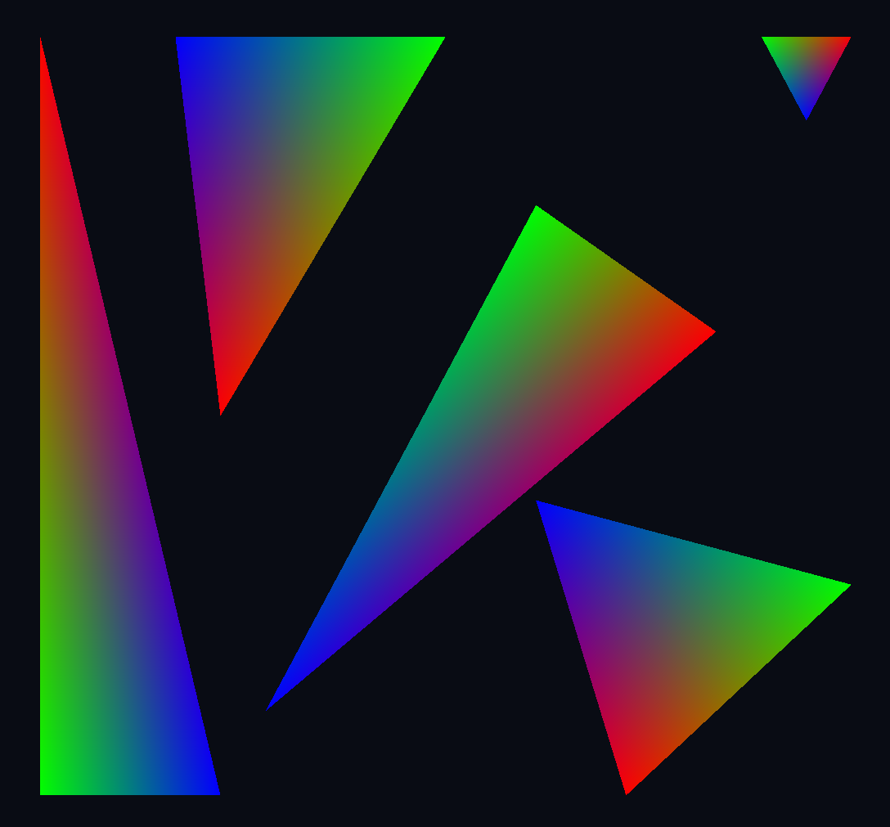
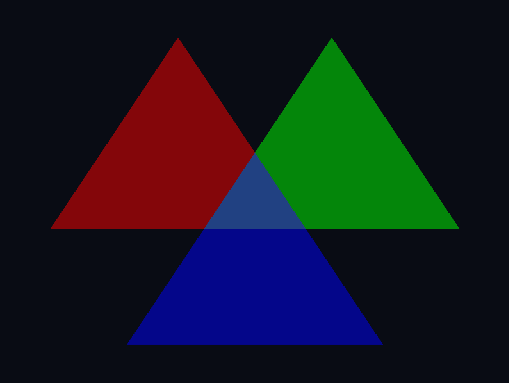

---
# This is a YAML preamble, defining pandoc meta-variables.
# Reference: https://pandoc.org/MANUAL.html#variables
# Change them as you see fit.
title: TDT4195 Exercise 2
author:
  - Øyvind Nestvold
  - Fredrik Robertsen
date: \today # This is a latex command, ignored for HTML output
lang: en-US
papersize: a4
geometry: margin=4cm
toc: false
toc-title: "Table of Contents"
toc-depth: 2
numbersections: true
header-includes:
# The `atkinson` font, requires 'texlive-fontsextra' on arch or the 'atkinson' CTAN package
# Uncomment this line to enable:
#- '`\usepackage[sfdefault]{atkinson}`{=latex}'
colorlinks: true
links-as-notes: true
# The document is following this break is written using "Markdown" syntax
---

## Task 1)

### a-b) Color VBO and shading coloring

This task was already implemented as part of exercise 1. But for ease of access we include the same render here.

OpenGL does a simple interpolation between the vertex colors, and assigns a color to a pixel during shading based on a weighted blend of the vertex colors based on how close the location of a pixel is to the vertices of the fragment. All weights should add up to 1, resulting in a varying mix of all the vertex colors at any given point in the fragment. In other words it does a simple linear interpolation.

## Task 2)

### a) Transparent triangles

Here we have drawn three partially overlapping triangles drawn in the order "red - green - blue" with red having the highest z-index (furthest back), followed by green and finally blue. All triangles are rendered with alpha = 0.4

### b) TODO

## Task 3)

### a-c)

Given a matrix defined as

$$
\begin{bmatrix}
a & b & 0 & c \\
d & e & 0 & f \\
0 & 0 & 1 & 0 \\
0 & 0 & 0 & 1
\end{bmatrix}
$$

we can adjust each variable $a, b, c, d, e$ and $f$ individually to observe all
affine transformations except pure rotations. This can be intuitively understood
from linear algebra, where a matrix represents a linear transformation of the
basis vectors. For example, the upper left 2x2 matrix described by $a, b, d$ and
$e$ tells us that we transform the $\mathbf{\hat{i}}$- and
$\mathbf{\hat{j}}$-vectors to $[a, d]^\intercal$ and $[b, e]^\intercal$
respectively. Thus can these four values alone perform shears and scaling on the
$x y$-plane, since these transformations are simple linear transformations as
such.

- If $b$ and $d$ are both zero, we will perceive a scaling effect equal to $a$
  in $x$-direction and $e$ in $y$-direction.
- Similarily, if only one of $b$ and $d$ are zero, we can see a shear, as one of
  the coordinate system vectors are only being scaled (it is being "held in
  place"), while the other is linearly transformed freely.
- Translation is encoded in $c$ and $f$, where they correspond to translation in
  $x$- and $y$-directions respectively.

If we want to perform a rotation, we have to modify all four values $a$, $b$,
$d$ and $e$ in conjunction and in accordance with the 2D rotation matrix,
otherwise we end up with a shear instead. Because we have to change these values
together, it is impossible to observe rotational transformations from only
changing one value at a time, starting from the identity matrix.
