---
# This is a YAML preamble, defining pandoc meta-variables.
# Reference: https://pandoc.org/MANUAL.html#variables
# Change them as you see fit.
title: TDT4195 Exercise 3
author:
  - Øyvind Nestvold
  - Fredrik Robertsen
date: \today # This is a latex command, ignored for HTML output
lang: en-US
papersize: a4
geometry: margin=4cm
toc: false
toc-title: "Table of Contents"
toc-depth: 2
numbersections: true
header-includes:
# The `atkinson` font, requires 'texlive-fontsextra' on arch or the 'atkinson' CTAN package
# Uncomment this line to enable:
#- '`\usepackage[sfdefault]{atkinson}`{=latex}'
colorlinks: true
links-as-notes: true
# The document is following this break is written using "Markdown" syntax
---

## Task 1c)

For this task, we simply applied the normal vectors as components of the
fragment shaders color vector. The resulting surface can be seen in the image
below:

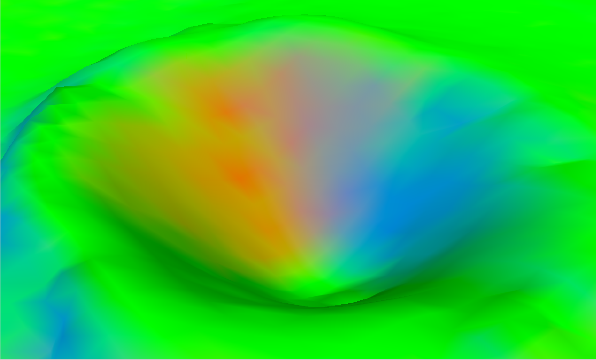

## Task 1d)

Applying the simple formula for the color vector of the fragment shader yields
a much more convincing lighting model as seen by the image below, though the
resolution of the model is somewhat questionable in terms of realism.

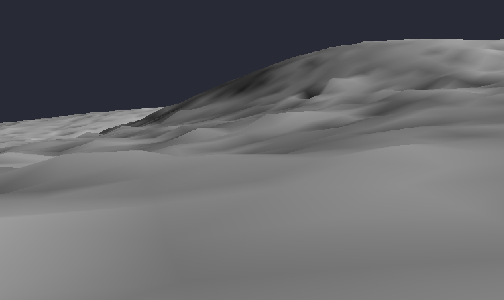

## Task 2c)

Applying a scenegraph to the scene, ensured we had to revamp alot of or
rendering logic. (All glory to the almighty ManualDrop<Pin<Box<SceneNode>>>>)
But disregarding all of that, it works very quite well. Below is an image of the
rendered helicopter.

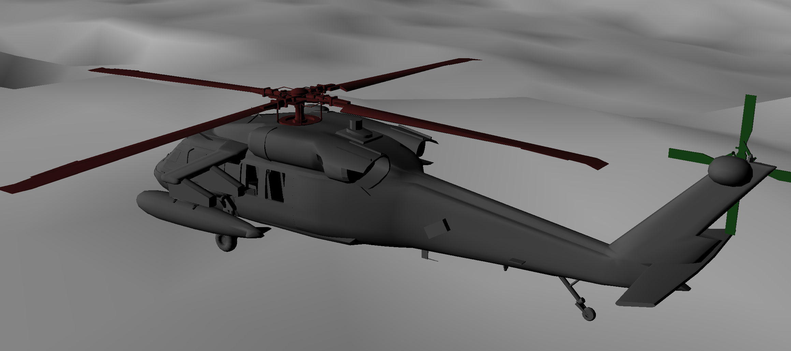

## Task 5a)

Below we highlight a lighting issue in our scene where transformed (moving)
objects have static normals in relation to the light vector, thus producing
unnatural lighting conditions where the "sun" follows the rotation of the
rotating objects independently. For example a rotating helicopter may be
brightly lit, but once rotated 180 degrees, is left in the dark.

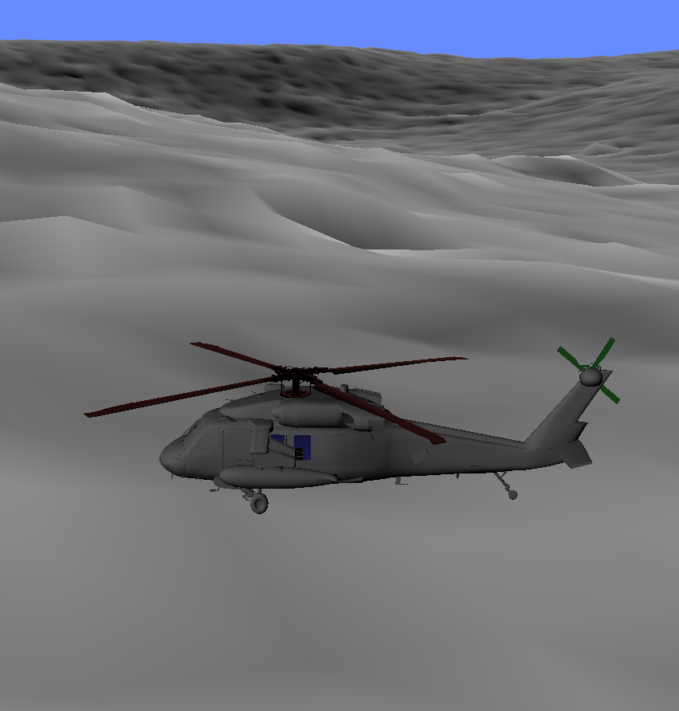
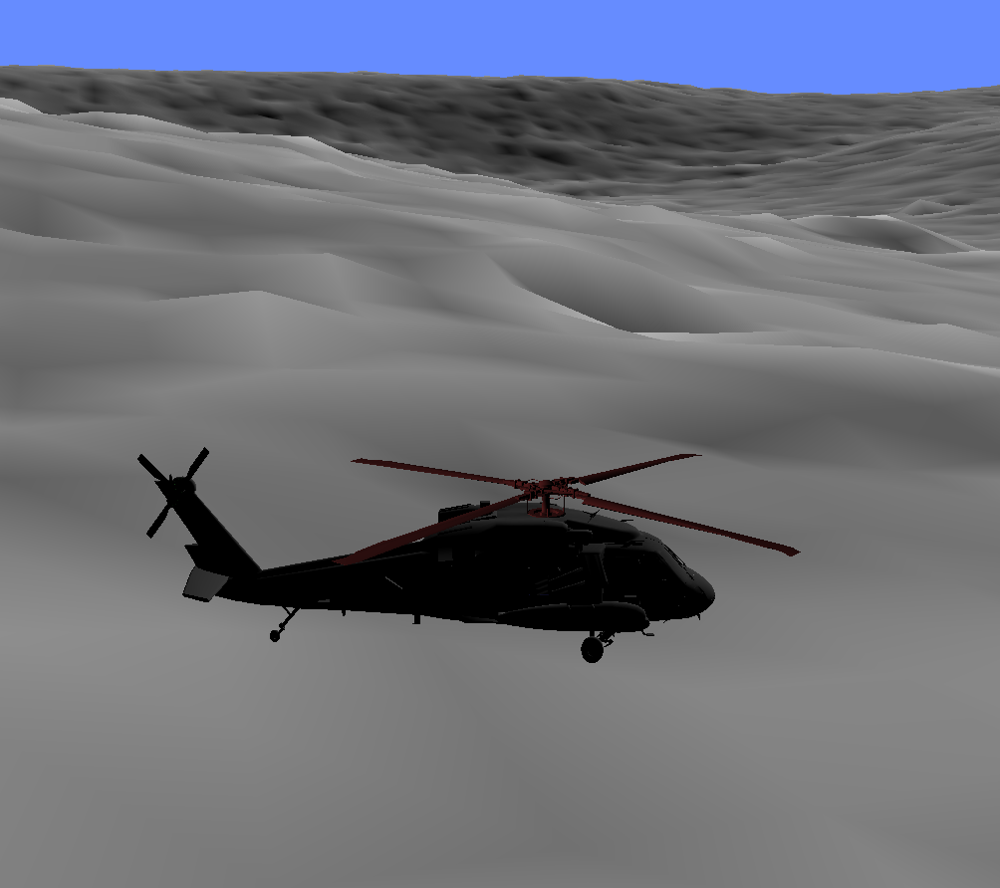

## Task 5c)

Fixing the lighting is a simple case of appyling the same transform as the
object itself (excluding view projections) to each normal, and normalizing the
normal to avoid maxing (or minmizing) the range of the color vector (which would
result in a pure white or black image in most circumstances). Below are images
of the new, corrected behaviour:

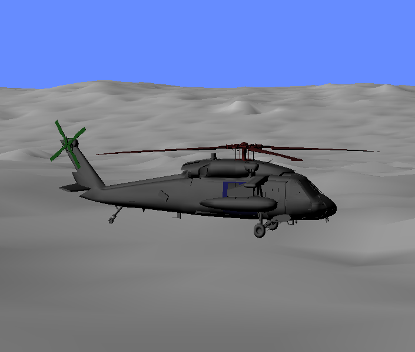
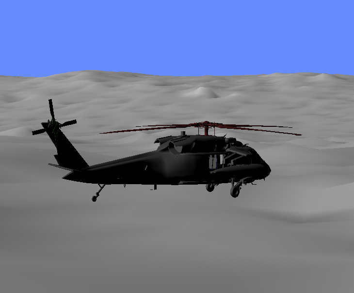

## Task 6a)

We solved this by producing and structuring 5 helicopter root `SceneNodes` in
a loop during our setup, aswell as running a loop over these nodes during the
draw step. Both loops are controlled by a single variable. We discussed reusing
a single `SceneNode` and deemed it possible, but settled on the above model as
keeping track of the transform for the individual models would be impractical in
any other scenario than parameterized animation. And since we wanted to
implement player controls for one of the helicopter in the optional tasks, we
deemed the reuse somewhat redundant extra complexity. Below is an image of the
coordinated choppers:

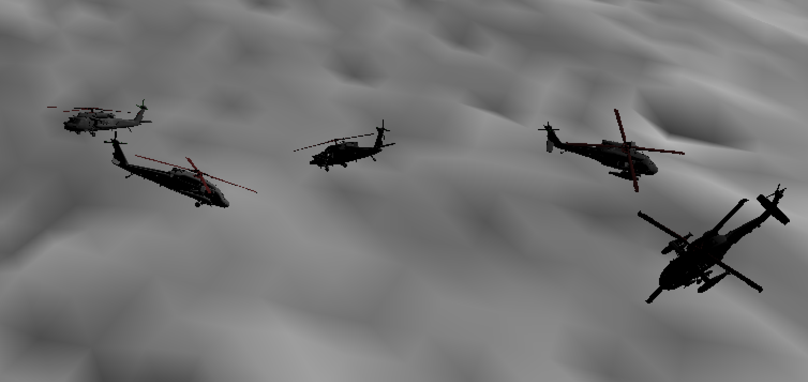

## Optional Tasks

### Optional a)

Implementing the Phong lighting model is a simple case of implementing the phong equation in the fragment shader. To achieve this, the viewing vector of each vertex had to be passed to the fragment. Based on how our camera is implemented, this vector is allways the inverse of the final vertex transform `glposition`. We pass this to the fragment shader, compute the ambient, diffuse and specular components and combine them to a single intensity vector (normalized) which we multiply, with the fragment color vector, thus producing the final color for the fragment. Below is an image of the phong model in action:

Please note that the parameters are not fine-tuned, and the resulting image is a bit 

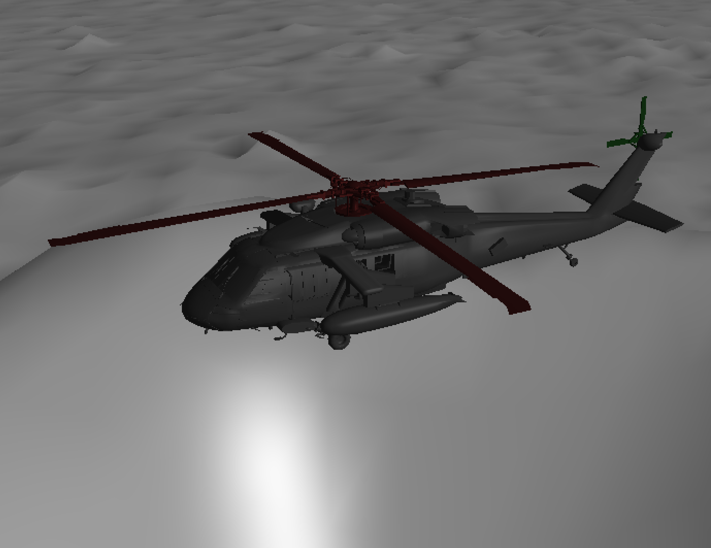

### Optional b)

The idea is to control the helicopter like an RC-car, because that is quite
intuitive and gives the same freedom as having it move where it is facing. After
correctly implementing movement using acceleration and drag, we just have to
tilt the helicopter in the direction it is facing by some value proportional to
it's speed.

`struct PlayerHelicopter` mainly has attributes for the acceleration- and
velocity vectors of the helicopter. Furthermore, we implemented directional unit
vectors `up`, `right` and `forward` on the `SceenNode` to easily gain an
orientation of the helicopter. With this, we can set the helicopter's
acceleration upon keyboard inputs (WASD) and add this to its velocity. We have
to remember to shrink the velocity on each update, doing so expontentially by
a drag factor and the `delta_time` variable, such that the helicopter will come
to a stop.

Combining this with rotation by the y-axis, we obtain RC-car controls. Lastly,
we have to tilt the helicopter in the direction it's facing using some math.

### Optional c)

To implement a chase camera we make a `struct ChaseCamera` with the following
attributes:

- `position`, where the camera currently is in global space.
- `target`, the position of the object the camera is chasing in global space.
- `radius`, how far away the target is allowed to be.
- `perspective`, the matrix from `glm::perspective` that contains information
  about the camera.

Taking in the `perspective` allows us to encode it outside of global state in
the program's main loop, keeping state related to the camera inside of this
struct. We could also have included other parameters such as the camera movement
speed, but this was kept in the main program for ease of use.

This struct implements some methods as well:

- `view_matrix`, which calculates the view transformation using the cursed
  `look_at`, using the struct attributes.
- `forward`, `up` and `right`, methods to calculate the directional unit
  vectors of the camera. These are useful for moving the camera.

Together with the flight controls of 6b), we obtain an intuitive and responsive
chase camera that follows the player helicopter.

The behavior emerges from this snippet in the main `update` loop:

```rust
  let camera_target = self.get_player_node();
  self.camera.target = camera_target.position;
  let distance = glm::distance(&self.camera.position, &self.camera.target);
  let direction = glm::normalize(&(self.camera.target - self.camera.position));
  if distance > self.camera.radius {
      self.camera.position += direction * (distance - self.camera.radius);
  }
```

Essentially just an "if the target is far away, catch up to it".

### Optional d)

The logic behind our approach is very quite simple, but at the same time a bit
more complex than it ever had to be. Since we were given the liberty of opening
the door, without ever haivng to close it, why not just get rid of it all
together with a fair push?

The implementation started by making a simple approximation of the path the door
might take. We opted for a simple version of the motion equations, and added
some randomness to the amount of rotation and speed of the door in the x-z
plane.

The release of the door is tracked by the event where the user presses the `E`
key, in which case an animation context is recorded and passed to the world. The
context keeps track of the animation function, origin of the animation, and the
start time of the animation. All animation contexts are processed at drawtime.

Now, since the door is still parented under the helicopter at the time it is
shot out of the helicopter, we must detach it to let it fall freely of the
transform of the helicopter. This is done by recording the global transform of
the door at the time of release (Note that all parents of the helicopter is
(0,0,0), meaning the global transform is simply set the helicopter), and
thereafter unchilding it from the helicopter.

Finally, the helicopter animationctx is stopped if it "falls out of the world",
in other words, if its y-position is less than `-1000.0`. At this point the
scenenode of the door is deleted.

Note the animation does not intend to be very realistic, the sort of cartoonish feel it gives is intentional and adds to the humorous factor of the animation.

A snippet of one possible shot of the animation is shown below.

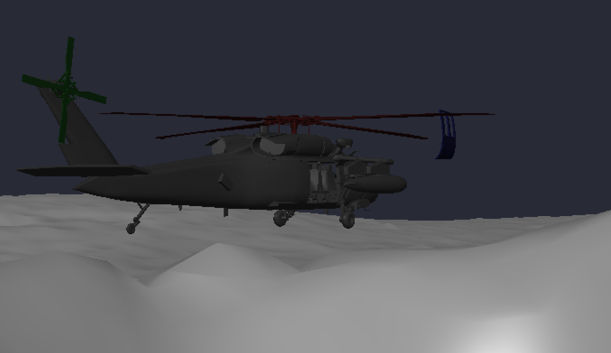

### Optional f)

The cake is a lie

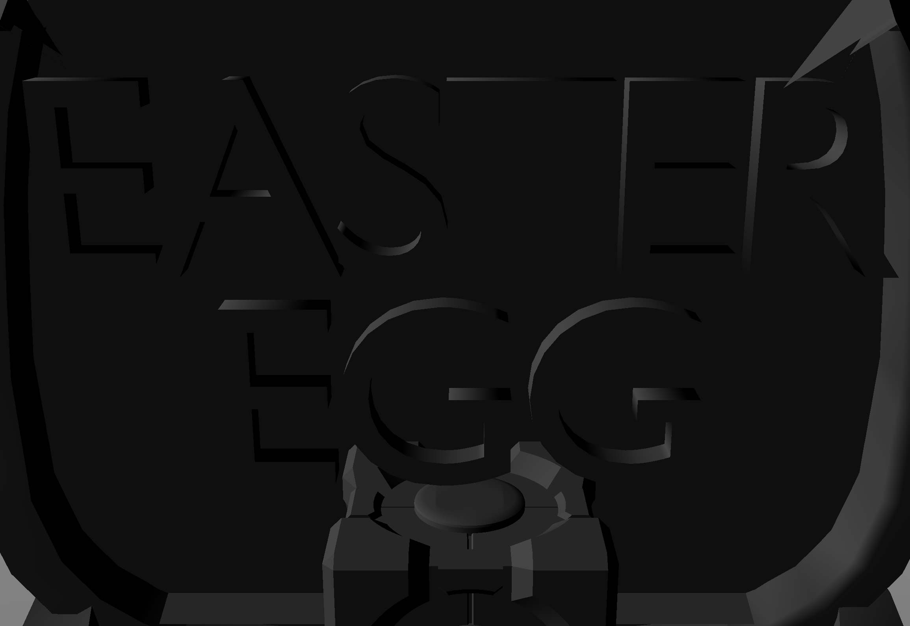
